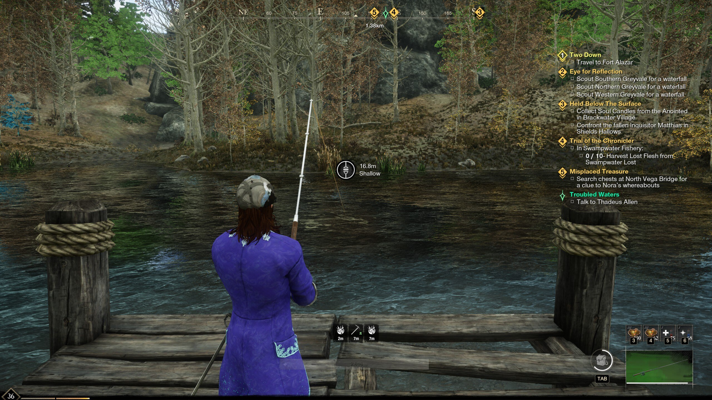
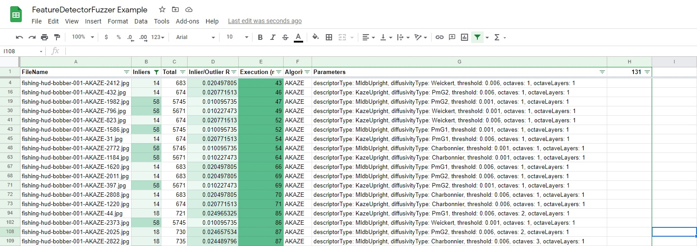
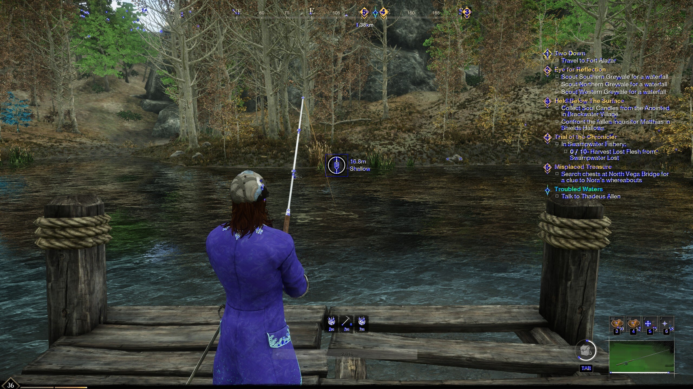

# OpenCv.FeatureDetection
A utility for image feature detection based on OpenCV (via EmguCV).

## Background
This project is intended to provide facilites for exploring OpenCV's feature detection (and, perhaps, other image recognition) capabilities against configured file inputs.

While going through the various OpenCV and EmguCV examples, I was displeased by the limited documentation for and sparse examples of effective use of OpenCV in various image recognition tasks. In lieu of comprehensive documentation, the best option available for determining suitable feature detection algorithms and configurations is to define testcases and evaluate performance against these testcases. To that end, this project was created. It serves the additional benefit of providing functional examples and notes of any insights learned along the way.

OpenCV (and, in its own ways, EmguCV) is hard to work with. With any luck, this project will make it *less* difficult for someone else.

## Operations
### Fuzzing feature detectors
#### Use Case
Let's say you have an image from which you'd like to extract features: 

You'd like to effectively and reliably extract features from a given area, such as the area around the fishing bobber HUD.

This operation lets you define a Region of Interest - a rectangle around that fishing bobber HUD - and effectively brute force calculate which algorithm (and parameters!) gives you meaningful metrics, such as:
* Count of _good_ features
* Ratio of _good_ to _bad_ features
* Ellapsed execution time
* Generated images for inspection and reference

You can then take this data, import it in a spreadsheet engine such as Google Sheets, and crunch the numbers to determine an acceptable configuration balancing quality of features and execution time.
Such a spreadsheet might look like [this](https://docs.google.com/spreadsheets/d/1MfKmHAyAWxln491PLZd9fc-Db1hcG4uE7BTON9nNY60/edit?usp=sharing):

You can quickly and easily identify file [fishing-hud-bobber-001-AKAZE-44.jpg](examples/fishing-hud-bobber-001-AKAZE-44.jpg) as a result with a relatively good inlier/outlier ratio and acceptable execution time, and review it to ensure quality of inliers: 

You now have everything you need in one place to make an informed decision about which algorithm and parameters is best for a given image or set of images.

#### Usage
OpenCV supports many feature detectors but has (at best) limited documentation. As a result, it's near-impossible to know if a given feature detector truly suits a usecase ahead-of-time.

This process exercises all available feature detectors (and many configurations) in OpenCV against a given set of example images and generates a report (and reference images) with the results. It is extremely computationally-intensive, but it will opt-in to use of OpenCL wherever OpenCV internally uses OpenCL.

It is expected that an 'input' folder is created containing all images expected to be used as testcases, along with a text file with an entry for every file describing:
* FileName to be processed
* Region of Interest (left, right, top, bottom coordinates) - this allows for determining an inlier/outlier (or, signal/noise) ratio

The generated report is CSV format for easy import to your spreadsheet of choice. It tracks:
* FileName processed
* Total feature count
* Feature count in defined Region of Interest
* Algorithm used
* Parameters for the algorithm used
* Execution time

Required Parameters:
* `-InputPath '<path>'` - directory containing inputs
* `-OutputPath '<path>'` - directory intended to contain the output report and generated reference images.

Optional Parameters:
* `-Algorithms <comma-separated set>` - Set of algorithms to run. If omitted, all algorithms are assumed. Useful for fuzzing a targeted set of algorithms.

Execution:
`OpenCv.FeatureDetection.Console.exe -Operation FuzzFeatureDetectors -InputPath <myPath> -OutputPath <myOutputPath>`

Note:
Fuzzing will generate many (50-150GB) of reference images per input image depending on size of input. It is suggested this be run with a large storage share as the output.

## OpenCV Usage
### Mat vs UMat
Using UMat in favor of Mat comes with serious performance implications. Benchmark often to determine which is more appropriate for your scenario.

The primary benefit of UMat is that wherever possible (and, in theory, _sensible_) OpenCV will opt for an OpenCL-accelerated execution route. Understand that GPU-accelerated OpenCL contexts can be _incredibly_ expensive to set up. For some cases, e.g. Feature2DToolbox.DrawKeypoints, the UMat variant ("accelerated") will run orders of magnitude slower than the Mat variant.

In practice, I've only observed gains from use of UMat with GPU-accelerated feature detection algorithms (e.g. AKAZE) and nowhere else in this codebase.

### Feature Detection Algorithms
#### AKAZE
Results for AKAZE are generally very good - important features are detected without unimportant features - but, even with GPU offload, execution time is high. This is not likely to be useful for high-performance scenarios (e.g. real-time) without dedicated hardware for processing offload.